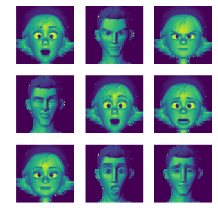
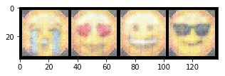
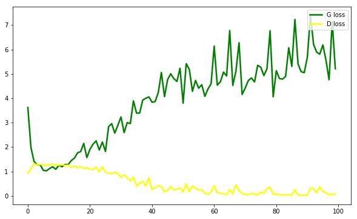

# Conditional-DCGAN using Pytorch
We use the c-Deep Convolutional Generative Adverserial Network model to generate animated faces :couple: and emojis :smiley: from a random noise fed as input.

Refrence:[Pytorch](https://pytorch.org/)
         [REF paper](https://arxiv.org/abs/1702.01983)  

## Requirements

	 1. Pytorch

## Usage

### Prepare Training Dataset 
Create folder named ``data`` . Then create folders according to your class-label names(n folders for n classes).Then place all images into the corresponding folder(class-label).

###### Folder structure

```
Root
│
├── data
│    └── train
│          ├── ONE
│          │    ├── ONE_0.png 
│    	   │	├── ONE_1.png
│    	   │	└── ...
│    	   ├── TWO
│          │    │ 
│    	   │	├── TWO_0.png
│    	   │	└── TWO_1.png
│    	   ├──	.
│    	   └── 	.
│
│ 
│
├── c-dcgan.ipynb
├── G_chk.pt
└── D_chk.pt 
```
 
> Larger the number and variation in images, larger the accuracy of classification.

### c-DCGAN Architecture

#### Generator Neural Network

```javascript

Generator (
  (DCV1_data): ConvTranspose2d(100, 256, kernel_size=(4, 4), stride=(1, 1))
  (BN1_data): BatchNorm2d(256, eps=1e-05, momentum=0.1, affine=True)
  (DCV1_label): ConvTranspose2d(2, 256, kernel_size=(4, 4), stride=(1, 1))
  (BN1_label): BatchNorm2d(256, eps=1e-05, momentum=0.1, affine=True)
  (DCV2): ConvTranspose2d(512, 256, kernel_size=(4, 4), stride=(2, 2), padding=(1, 1))
  (BN2): BatchNorm2d(256, eps=1e-05, momentum=0.1, affine=True)
  (DCV3): ConvTranspose2d(256, 128, kernel_size=(4, 4), stride=(2, 2), padding=(1, 1))
  (BN3): BatchNorm2d(128, eps=1e-05, momentum=0.1, affine=True)
  (DCV4): ConvTranspose2d(128, 64, kernel_size=(4, 4), stride=(2, 2), padding=(1, 1))
  (BN4): BatchNorm2d(64, eps=1e-05, momentum=0.1, affine=True)
  (DCV5): ConvTranspose2d(64, 3, kernel_size=(4, 4), stride=(2, 2), padding=(1, 1))
)
```
#### Discriminator Neural Network

```javascript

Discriminator (
  (CV1_data): Conv2d(3, 64, kernel_size=(4, 4), stride=(2, 2), padding=(1, 1))
  (CV1_label): Conv2d(2, 64, kernel_size=(4, 4), stride=(2, 2), padding=(1, 1))
  (CV2): Conv2d(128, 256, kernel_size=(4, 4), stride=(2, 2), padding=(1, 1))
  (BN2): BatchNorm2d(256, eps=1e-05, momentum=0.1, affine=True)
  (CV3): Conv2d(256, 512, kernel_size=(4, 4), stride=(2, 2), padding=(1, 1))
  (BN3): BatchNorm2d(512, eps=1e-05, momentum=0.1, affine=True)
  (CV4): Conv2d(512, 1024, kernel_size=(4, 4), stride=(2, 2), padding=(1, 1))
  (BN4): BatchNorm2d(1024, eps=1e-05, momentum=0.1, affine=True)
  (CV5): Conv2d(1024, 1, kernel_size=(4, 4), stride=(1, 1))
)

```

### Training 

Run the ``c-dcgan.ipynb`` jupyter notebook to start the Training.

Once the training is completed the result is stored the main folder as ``D_chk_100.pt`` and ``G_chk_100.pt``

###### Input-data


###### Sampled mini-batch images


###### Training through Epochs


###### Final Generated Images

<br/>



###### Loss


#### ToDo
- [x] Train.
- [x] Save/Load checkpoint.
- [x] Generate.
- [ ] UI for input, output and to download checkpoint.

##### Credits
```javascript
@inproceedings{aneja2016modeling,
  title={Modeling Stylized Character Expressions via Deep Learning},
  author={Aneja, Deepali and Colburn, Alex and Faigin, Gary and Shapiro, Linda and Mones, Barbara},
  booktitle={Asian Conference on Computer Vision},
  pages={136--153},
  year={2016},
  organization={Springer}
}
```


